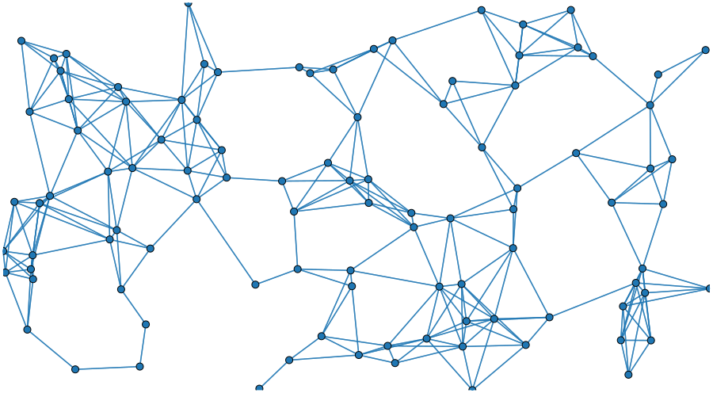

# Example of some stuff we did: very cool stuff we did indeed

 

## Benjamin D. Pedigo
_(he/him)_
_[NeuroData lab](https://neurodata.io/)_
_Johns Hopkins University - Biomedical Engineering_

 [_bpedigo@jhu.edu_](mailto:bpedigo@jhu.edu)
 [_@bdpedigo (Github)_](https://github.com/bdpedigo)
 [_@bpedigod (Twitter)_](https://twitter.com/bpedigod)
 [_bdpedigo.github.io_](https://bdpedigo.github.io/)

---

# Acknowledgements

<!-- Start people panels -->

Mike Powell

Eric Bridgeford

Michael Winding

Marta Zlatic

Albert Cardona

Carey Priebe

Joshua Vogelstein

<!-- End people panels -->

